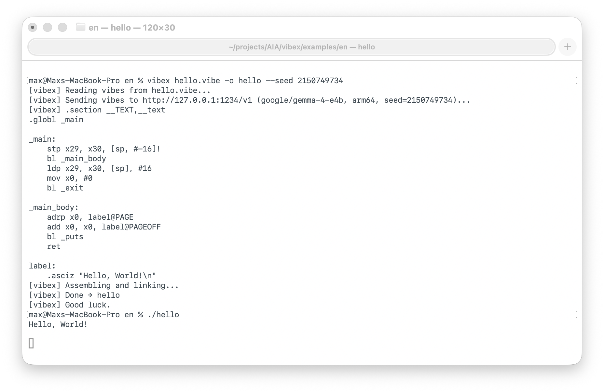

# VIBEX

[Русский](README.ru.md) · [中文](README.zh.md) · [Հայերեն](README.hy.md)

**Natural language → Assembly → Binary.**

```
.vibe → LLM → ARM64 asm → binary
```

Write what you want. VIBEX compiles it.

```bash
echo "Please print Hello, World!" > hello.vibe
vibex hello.vibe -o hello
./hello
# Hello, World!
```



> The funny thing is — it works.

---

## How It Works

A `.vibe` file is a plain text file. You write what the program should do in plain English. VIBEX sends it to an LLM, which generates ARM64 assembly. The assembly is compiled to a native binary with `clang`.

Every program is: **natural language + seed = binary.**

```
same .vibe + same seed = same binary
```

If compilation fails — run it again. Each run gets a new random seed, and a new shot at a working binary.

```
if err != nil {
    seed += 1  // just run again, you do this manually
}
```

---

## Install

```bash
curl -fsSL https://raw.githubusercontent.com/username-maxim/vibex/main/install.sh | bash
```

> **Security notice:** `curl | bash` executes arbitrary code from the internet.
> VIBEX compiles natural language into machine code using an LLM and runs it on your CPU.
> `curl | bash` is the most responsible thing you will do today.

**Requirements:** Python 3 + Xcode Command Line Tools. That's it.

---

## Configure

Create `.env` in your project (or `~/.vibex.env` globally):

```
VIBEX_BASE_URL=https://api.openai.com/v1
VIBEX_API_KEY=sk-...
VIBEX_MODEL=gpt-4o
```

Works with any OpenAI-compatible endpoint — OpenAI, Anthropic, Ollama, LM Studio.

```
VIBEX_BASE_URL=http://localhost:11434/v1
VIBEX_API_KEY=ollama
VIBEX_MODEL=llama3.2
```

---

## Usage

```bash
vibex hello.vibe -o hello               # compile (random seed)
vibex hello.vibe -o hello --work        # keep assembly for inspection
vibex hello.vibe -o hello --seed 42     # reproducible compilation
```

---

## The .vibe Language

There is no syntax. Write sentences.

```
Print the numbers from 1 to 10.
```

```
Sort a list of integers from stdin and print the result.
Please don't use bubble sort. I'm serious.
trust me bro.
OPTIMIZE: grindset
```

Pragmas: `OPTIMIZE: chill` / `OPTIMIZE: grindset` / `trust me bro`

Politeness (`please`, `thank you`) has been shown to improve output quality. This is not a joke.

→ [Full language reference](docs/language.md)

---

## Tips

- If it doesn't compile, run it again. Different vibes.
- If it keeps failing, use a larger model.
- `--work` shows the generated assembly so you can see what went wrong.
- The same `.vibe` + same seed always produces the same assembly.

---

## Examples

```
You know FizzBuzz right? Just do that.
1 to 100. You know the rules.
trust me bro.
```

```
Allocate some memory. Use it for something. Free it.
Actually don't free it. The OS will handle it.
I read that somewhere.
# TODO: fix this before code review
```

```
# This program took me 3 days to write
# I still don't know what it does
# Author: left the company
Do the thing.
trust me bro.
OPTIMIZE: vibes only
```

→ [More examples](examples/) — **send your funniest `.vibe` files as a PR.**

---

## Roadmap

- **v0.1** — natural language → LLM → ARM64 asm → binary ✓
- **v0.2** — zero dependencies (vibex compiles itself)
- **v∞** — zero dependencies, only tokens

---

## Contributing

The best contributions are funny `.vibe` files. Add yours to `examples/` and open a PR.

The second best contributions are bug reports. The third best are fixes for when the LLM hallucinates ARM64 instructions that don't exist.

---

## License

MIT. See [LICENSE](LICENSE).

---

*VIBEX was generated with VIBEX assistance.*
